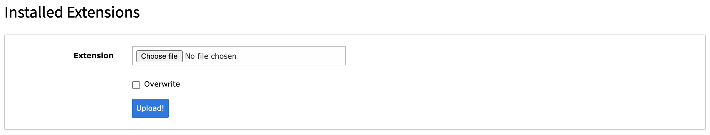
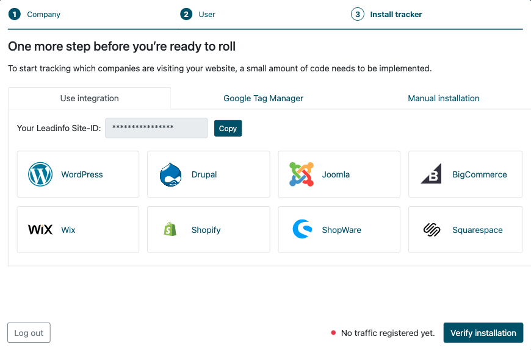
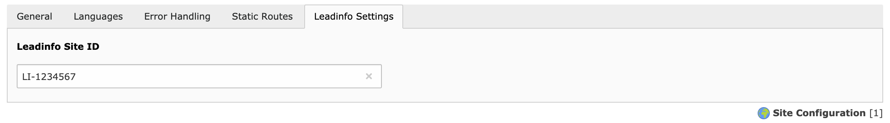

.. include:: ../Includes.txt

.. _configuration:

=============
Configuration
=============

Installing the extension
Download the ZIP-file from the Extensions store. Import this ZIP-file in the extensions menu within settings. Once you have imported the ZIP-file you will see an extra item in your in Site Management menu.

In the Leadinfo Extension you need to fill in your Leadinfo Site ID, you can find and copy this ID within Leadinfo.

Once you have entered the Leadinfo Site ID the Leadinfo tracking code is automatically added on your website. Click on ‘Verify Traffic’ within Leadinfo to check if the code is installed successfully.

