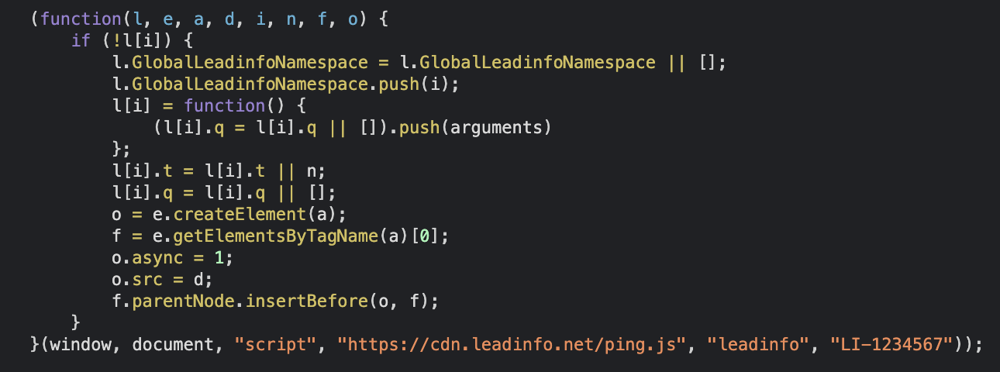

.. include:: ../Includes.txt

.. _introduction:

============
Introduction
============

.. _what-it-does:

What does it do?
================

This extension will provide a tracking code to recognize anonymous B2B website visitors with Leadinfo. The code will be placed in front of the </body> tag to each page rendered by Typo3.
The User has full control of Global Configuration (done in the ExtensionManager) and Individual Adjustments (via page properties).
However, for a full qualified overview of Leadinfo’s features, it is strongly recommended to read this Documentation or `contact Leadinfo’s Customer Success Team <https://https://www.leadinfo.com/en/contact>`_.

	Tracking-Code just after installation

How the Code is inserted into the HTML-Architecture right before the closing "head"-Tag.
